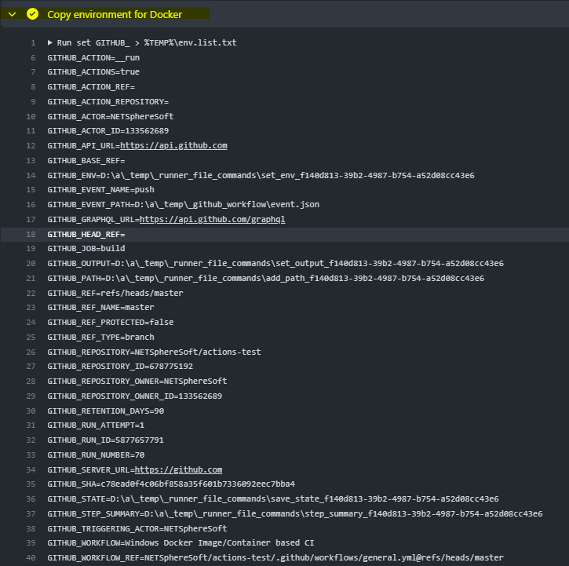
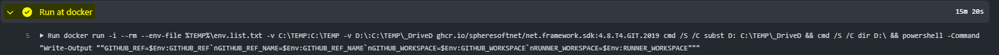
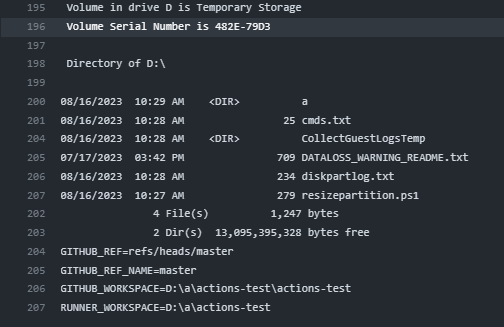

| [Index](../index.md) | [GITHub](../GITHub.md) |

<hr style="height: 1px" />

- [Description of GITHub workflow file](#description-of-the-github-workflow-file)
- [Content of GITHub workflow file](#content-of-the-github-workflow-file)

# Workflow using Windows Docker Image/Container


## [Description of GITHub workflow file](#)

Using a Windows Docker Image/Container at GITHub workflow actions is not direct
supported. But GITHub runners have a Docker installation, so Windows Docker Images
can be used and managed. One disadvantage this has - acting on Docker needs mostly
between 15 to more than 30 minutes, so have patience.

To use a Windows Runner you need to use the `runs-on` directive in your `job`.
GITHub supports `windows-2019` and `windows-2022`. So you can use images based
on Micosoft Windows images with `LTSC` of `2019` and `2022`.

The following sample uses a GITHub standard template for workflow. Here we
configure a Runner `windows-2019` for the official Microsoft .NET Framework SDK 4.8
image on Windows Server Core 2019 LTSC ([mcr.microsoft.com/dotnet/framework/sdk:4.8-windowsservercore-ltsc2019](https://hub.docker.com/_/microsoft-dotnet-framework-sdk/)).

After standard checkout from GITHub we need the related environment variables
which we store in a temporary file for use with docker. The next step is then
the docker run it self. We start them interactive, take sure you use `-i` instead
of `-it` which some times to see. Additional we want remove the running container
after our run, so we use `--rm`. With `--env-file` we load the original environment
from the temporary file into our docker environment. `C:\TEMP` directory will be
used for exchange of data between the Runner and the Docker container. GITHub
Runner checking the project out to drive `D:`. Docker doesn't support a mapping
of Windows drives into an image (also not with the VOLUME directive). So we use
a workaround. First mapping the `D:` drive into the sub directory `C:\TEMP\_DriveD`
of our Docker container. Inside the container we map sub directory `C:\TEMP\_DriveD`
back to drive `D:` with the `subst` command. At last we can start a powershell
direct command or a command file as argument to the `-Command` call of powershell.

As result from the workflow run you will see a section `Copy environment for Docker`
with the forwarded environment. In another section `Run at docker` you will find
the result of `dir D:\` command and the output from the direct command for powershell -
the content of enviroment variables `GITHUB_REF`, `GITHUB_REF_NAME`, `GITHUB_WORKSPACE`
and `RUNNER_WORKSPACE`.







## [Content of GITHub workflow file](#)

```yaml
# This is a basic workflow to help you get started with Actions

name: Windows Docker Image/Container based CI


# Controls when the workflow will run
on:
  push:
    branches:
      - '**'
  pull_request:
    branches:
      - '**'

  # Allows you to run this workflow manually from the Actions tab
  workflow_dispatch:

# A workflow run is made up of one or more jobs that can run sequentially or in parallel
jobs:
  # This workflow contains a single job called "build"
  build:
    # The type of runner that the job will run on
    runs-on: windows-2019
    # container: mcr.microsoft.com/dotnet/framework/sdk:4.8-windowsservercore-ltsc2019

    # Steps represent a sequence of tasks that will be executed as part of the job
    steps:
      # Checks-out your repository under $GITHUB_WORKSPACE, so your job can access it
      - uses: actions/checkout@v3

      - name: Copy environment for Docker
        shell: cmd
        run: |
             set GITHUB_ > %TEMP%\env.list.txt
             set RUNNER_ >> %TEMP%\env.list.txt
             type %TEMP%\env.list.txt

      - name: Run at docker
        shell: cmd
        run: >-
             docker
             run
             -i
             --rm
             --env-file %TEMP%\env.list.txt
             -v C:\TEMP:C:\TEMP
             -v D:\:C:\TEMP\_DriveD
             mcr.microsoft.com/dotnet/framework/sdk:4.8-windowsservercore-ltsc2019
             cmd /S /C subst D: C:\TEMP\_DriveD &&
             cmd /S /C dir D:\ &&
             powershell -Command "Write-Output ""GITHUB_REF=$Env:GITHUB_REF`nGITHUB_REF_NAME=$Env:GITHUB_REF_NAME`nGITHUB_WORKSPACE=$Env:GITHUB_WORKSPACE`nRUNNER_WORKSPACE=$Env:RUNNER_WORKSPACE"""
```

File can be downloaded [here](WindowsDocker.yml).


<!-- FOOTER -->
<hr style="height: 1px" />
<span style="font-size: 0.7em">© SphereSoft.NET, Holger Boskugel, Berlin, Germany</span>
<a href="http://spheresoft.net" style="font-size: 0.7em; float: right">spheresoft.net</a>
